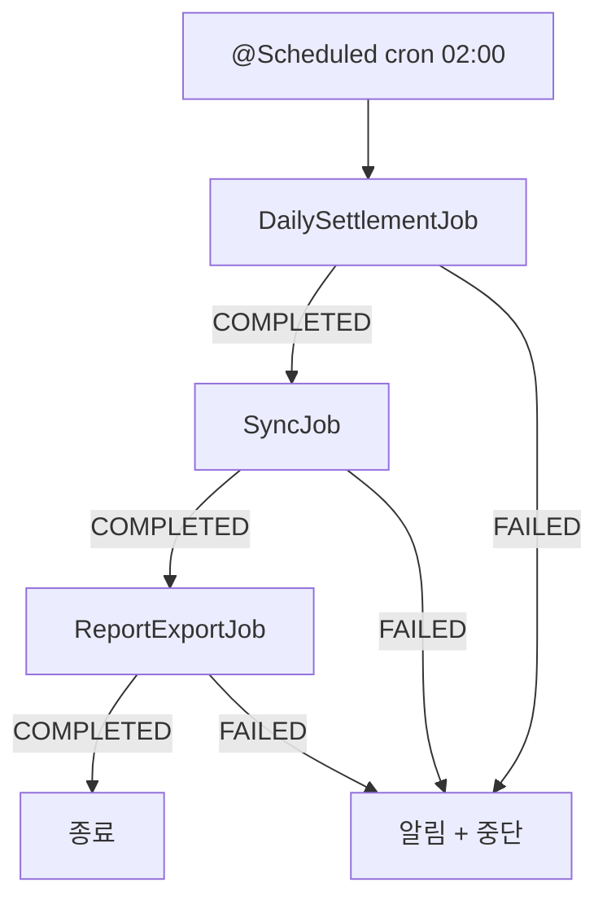
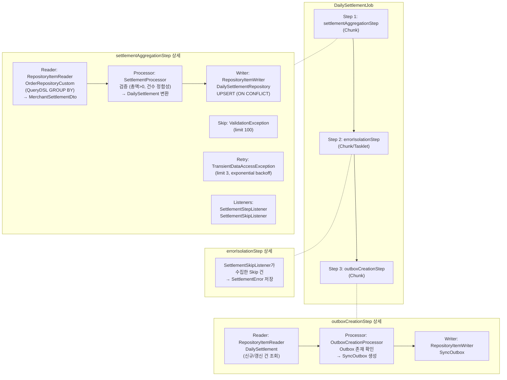
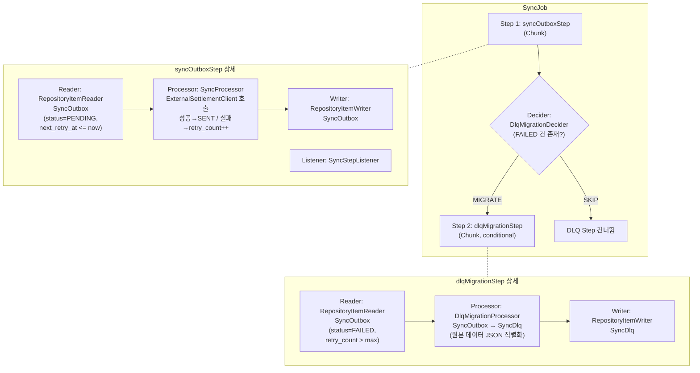
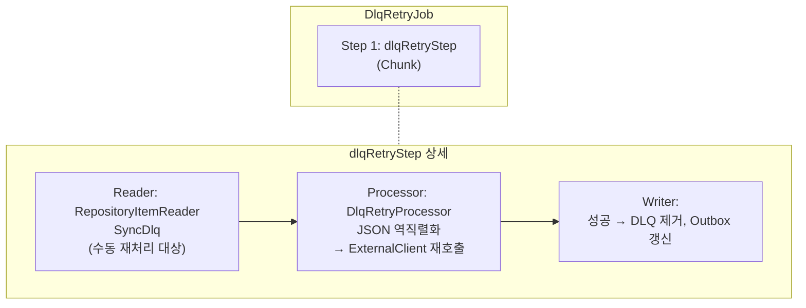
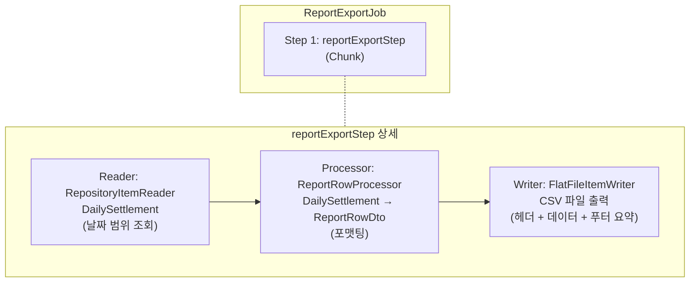
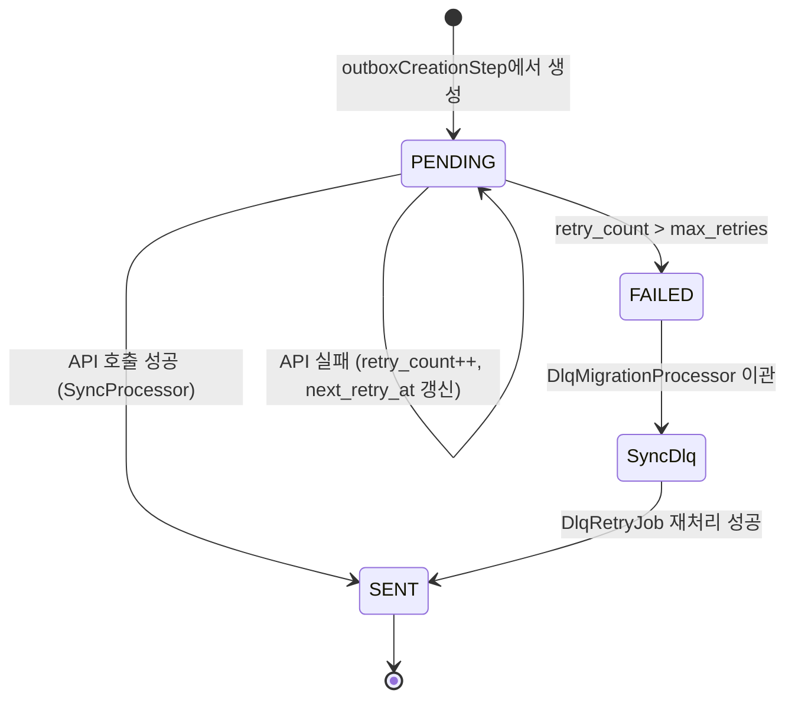
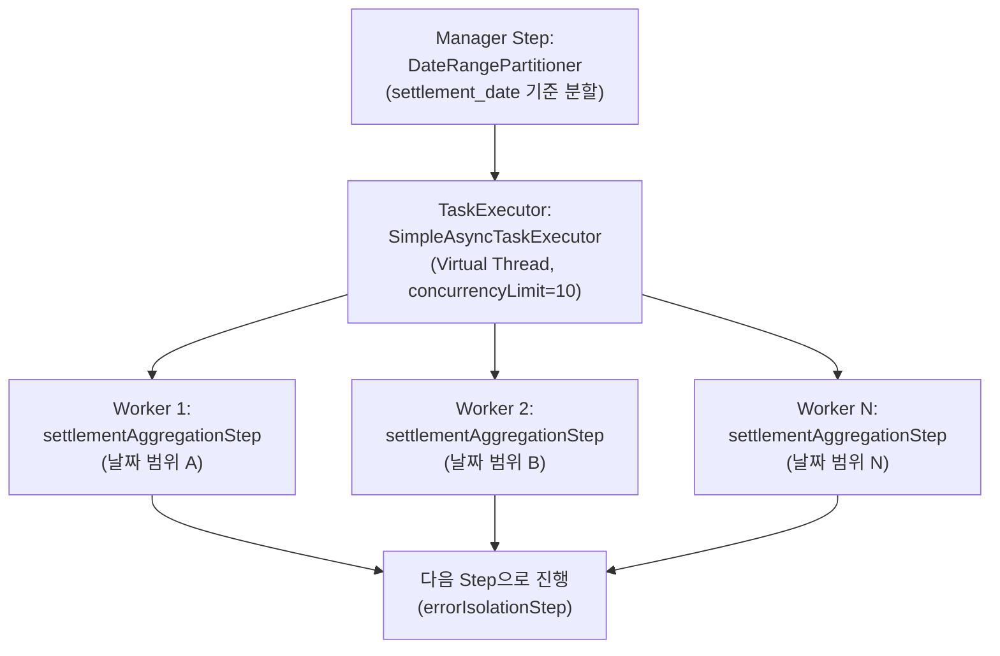

# Batch Job Flow Diagram

> 기존 Phase 계획 문서(Phase 2~4)를 기준으로 작성한 Mermaid 다이어그램이다.
> Job/Step 구조가 변경되면 이 다이어그램도 함께 업데이트한다.

---

## 1. Job Orchestration (SettlementScheduler)

매일 02:00에 순차 실행되며, 선행 Job 실패 시 후속 Job을 중단한다.

---

## 2. DailySettlementJob

JobParameters: `settlementDate` (미지정 시 D-1)

---

## 3. SyncJob

---

## 4. DlqRetryJob (수동 트리거)

---

## 5. ReportExportJob

---

## 6. Outbox State Machine

---

## 7. Phase 4: Partitioning (DailySettlementJob 확장)

Phase 4에서 settlementAggregationStep에 파티셔닝이 적용된다.

